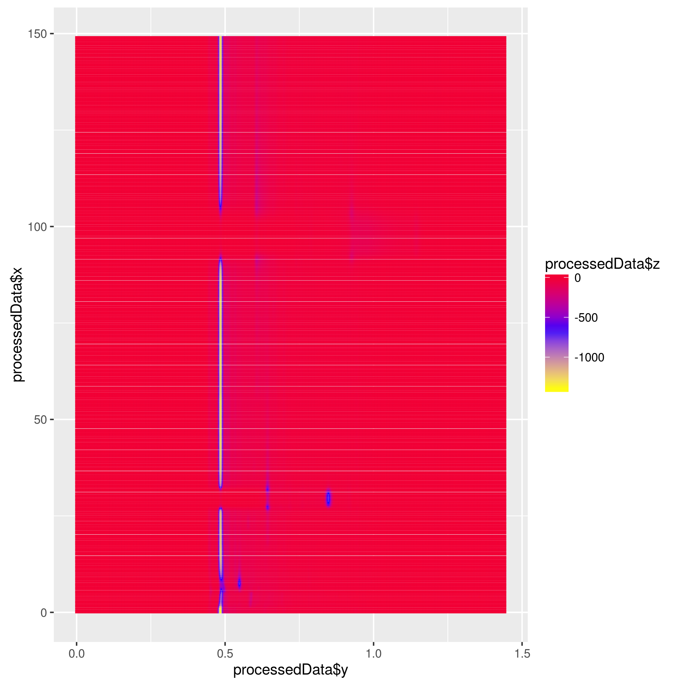
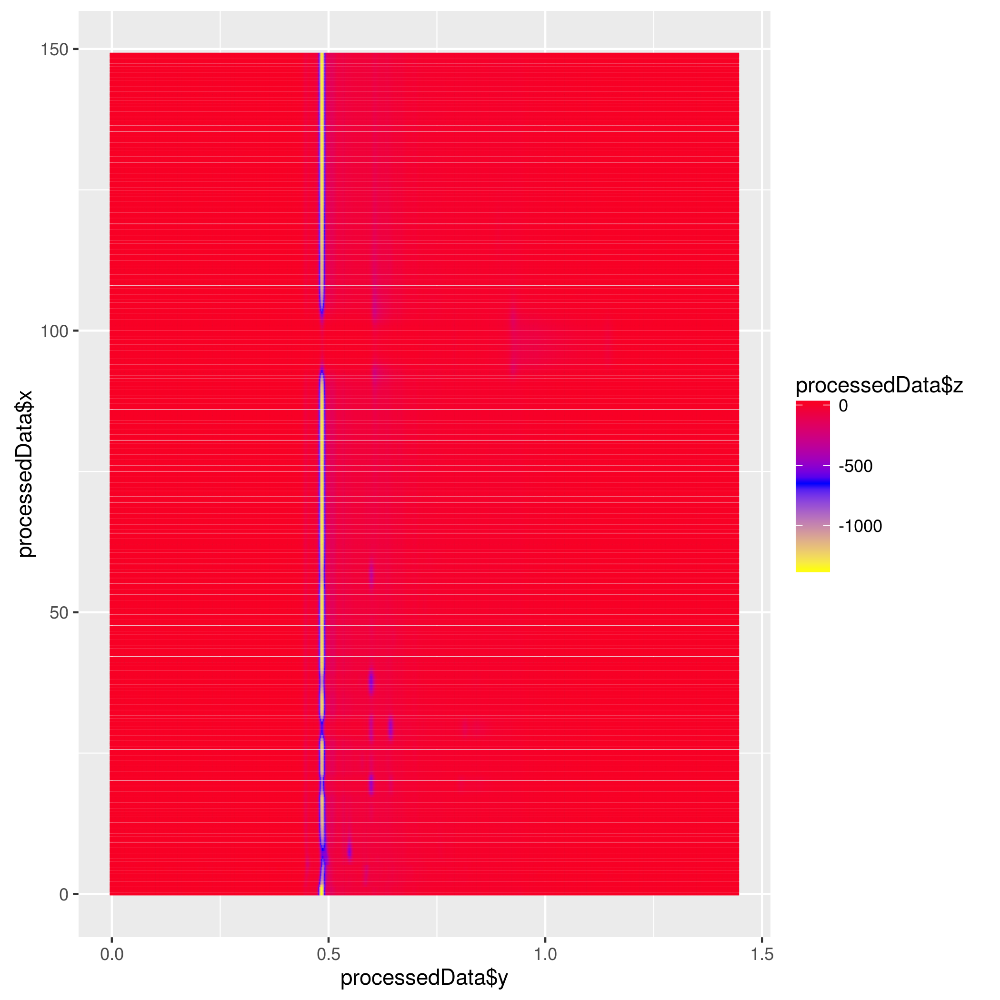
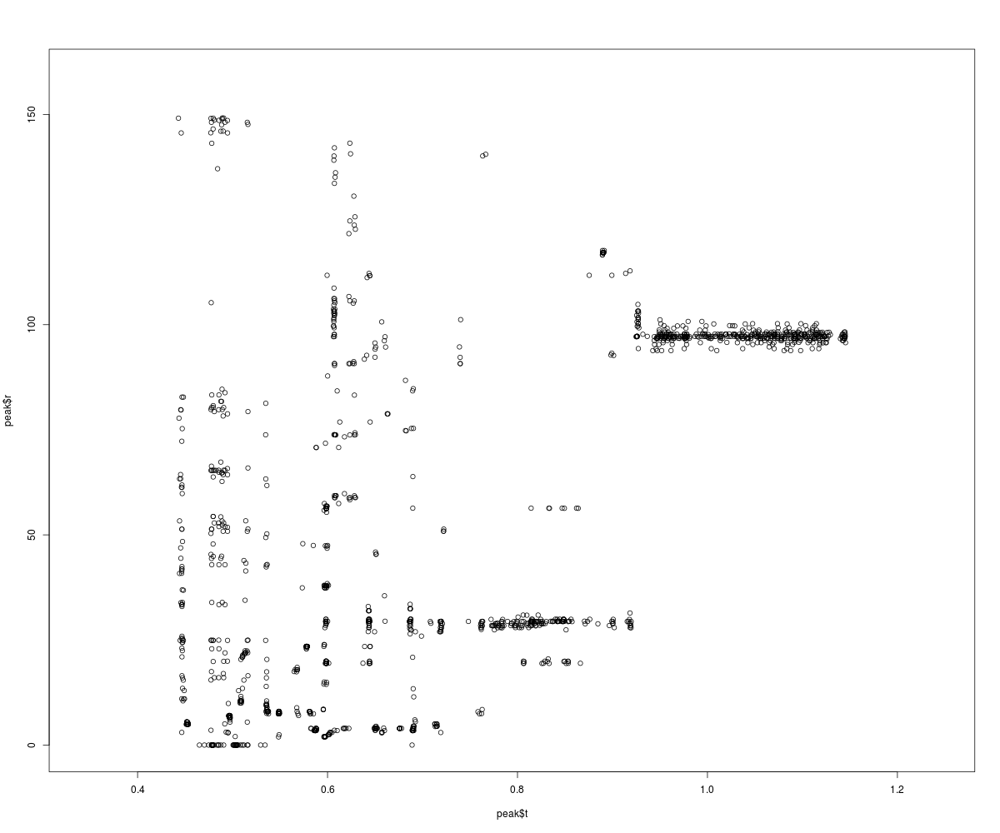
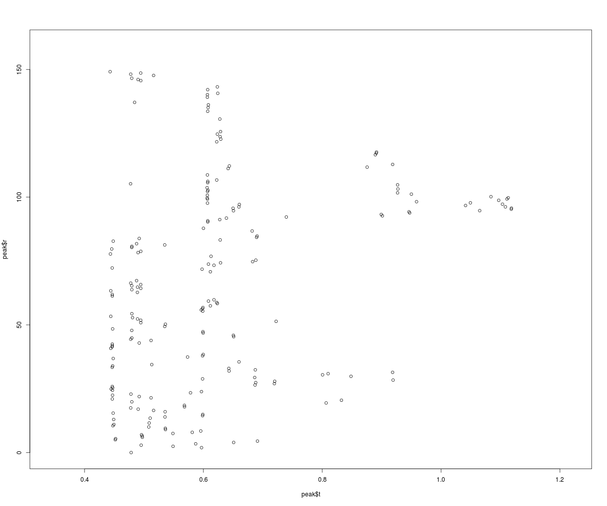

# Manual for DM847 Exam Project

Group members: latho12, dathr12, hschu12, anbus12, pegot12

<!-- MarkdownTOC -->

- [Status of Implementation](#status-of-implementation)
- [Requirements](#requirements)
- [The Contents of the Folder](#the-contents-of-the-folder)
- [How to Compile](#how-to-compile)
- [Results](#results)
    - [Example Density Plots](#example-density-plots)
    - [Peak Alignment](#peak-alignment)
    - [Results from 5-fold Cross Validation](#results-from-5-fold-cross-validation)
    - [Results from Random Forest Prediction](#results-from-random-forest-prediction)
    - [Results from Attribute Selection](#results-from-attribute-selection)
    - [Results from Decision Tree Trained on Reduced Data Set](#results-from-decision-tree-trained-on-reduced-data-set)

<!-- /MarkdownTOC -->

## Status of Implementation

__Legend:__

  - [✓]: Done, 
  - [~] Not possible in WEKA, workaround used
  - [-] Still needs a bit work)

__Work status:__

  1. [✓] Reads several raw data files
  2. [✓] Generate density plots
  3. [✓] Call PEAX to generate peaks
  4. [✓] Implement peak alignment
  5. [✓] Read the class file and assign labels
  6. [✓] Create a matrix for training
  7. [✓] Create a peak alignment matrix
  8. [✓] Train a random forest classifier
  9. [✓] Implement 5-fold cross validation
  10. [✓] Report the mean accuracy, sensitivity, and specificity
  11. [~] Extract the five most discriminating features (peaks) ~~by using the
  Gini index~~. 
      - __This is not possible to do in weka, instead we do this the weka way.
        Jan has already told us that we can choose these in any way, since he
        doesn't know how to do this in weka, only in R.__
  12. [-] Learn and plot/report a decision tree by using only these five best
      features/peaks
      - __TODO We get some rather weird results from this. See
        FeatureSelector.java, we currently get a nice sub-set of attributes,
        which all seem to be working just fine. However we do have problems
        with producing a nice tree (J48), as it always seem to split on only a
        single feature (p37).__
  13. [✓] Use code from part one to process and align training and test data
  14. [✓] Apply classifier learned in part 1. 
  15. [✓] Hand in the predicted test set.

## Requirements

The following are the requirements, to be able to compile and run this
project:

  - Java 8 (JRE and JDK)
  - Maven
  - Linux Enviornment due to PEAX and WEKA both requireing this.

Additionally Maven pulls in the following dependencies:

  - weka-stable, v3.6.13

## The Contents of the Folder

The following is the directory structure of our hand-in. Comments for each
file are in square brackets, i.e. `[Comment goes here]`.

```text
├── candy_labels [Contains data files for labelled input]
│   ├── BD18_1511121654_ims.csv [Raw input file]
│   ├── labels.csv [Contains the labels for the file]
│   ├── output [Output of the processing stage]
│   │   ├── BD18_1511121654_ims_density_plot.png [Density plot]
│   │   └── final_BD18_1511121654_ims.csv [Output from PEAX]
├── candy_no_labels [Contains input files with no label]
│   ├── BD18_1511110743_ims.csv [Raw input file]
│   └── output [Output of the processing stage]
│       ├── BD18_1511110743_ims_density_plot.png
│       └── final_BD18_1511110743_ims.csv
├── candy_raw [Input files from part 1]
│   ├── BD18_1408280826_ims.csv
│   ├── files categories.txt
│   └── output
│       └── final_BD18_1408280826_ims.csv
├── peax [Contains the PEAX binaries and config]
├──src/main/java/dk/sdu/dm847/exam/ [Source folder + Package structure]
│   ├── CsvParser.java [Utility class for parsing CSV files]
│   ├── RunMe.java [The main class for running all the parts]
│   ├── task1
│   │   ├── Label.java [Models a label]
│   │   ├── Peak.java [Models a peak]
│   │   ├── PeakAlignment.java [Runs the peak alignment]
│   │   └── PreprocessData.java [Runs PEAX and creates density plots]
│   ├── task2
│   │   ├── FeatureSelection.java [Runs feature selection, and trains a model]
│   │   ├── Predict.java [Predicts based on a given model on some test data]
│   │   └── Train.java [Trains a model based on previous output]
│   └── ToolUtils.java [Utility for running PEAX and R]
├── all_peaks.png [Contains peaks before alignment]
├── plot.png [Contains peaks after alignment]
├── R-plot.r [Utility file for creating density plots]
├── peakAlignedLabelled.arff [Processed training data]
├── peakAlignedUnlabelled.arff [Processed test data]
├── halls_rf_trained.model [Model ready to be used]
├── halls_prediction.csv [Prediction based on model]
├── pom.xml [Build file for Maven]
├── README.md [This file]
```

## How to Compile

The project should be importable through IntelliJ IDEA 15, or it should be
possible to compile from the command-line using Maven with:

```
cd ROOT_DIRECTORY_OF_PROJECT
mvn compile
```

And it may be run using:

```
cd ROOT_DIRECTORY_OF_PROJECT
mvn exec:java -Dexec.mainClass="dk.sdu.dm847.exam.RunMe" -Dexec.classpathScope=runtime
```

## Results
The final_results.txt contains the predictions for the class labels. This is in the correct format that is required by: http://teaching.compbio.sdu.dk/ . The predictions is off by 2 or 3, but this may be because of overfitting. It uses all the peaks it finds, but only the top 5 are required. This could not be solved without using the Weka GUI, as the coding API does not allow us to extract these.

### Example Density Plots

The following shows two examples of the density plots generated.

The following shows a density plot for an original halls:



This shows for a citrus halls:



### Peak Alignment

Results from PEAX (Before alignment):



After peak-alignment, notice how a lot of peaks that are nearby are clusted
into a single one:



### Results from 5-fold Cross Validation

```text
Kappa statistic                          0.8571
K&B Relative Info Score                392.8261 %
K&B Information Score                    3.9283 bits      0.2806 bits/instance
Class complexity | order 0              14      bits      1      bits/instance
Class complexity | scheme               10.28   bits      0.7343 bits/instance
Complexity improvement     (Sf)          3.72   bits      0.2657 bits/instance
Mean absolute error                      0.3862
Root mean squared error                  0.4028
Relative absolute error                 77.2381 %
Root relative squared error             80.5517 %
Total Number of Instances               14     

Mean sensitivity: 0.9
Mean specificity: 1.0
Mean accuracy: 0.9333333333333332
```

Note that the cross-validation is tested on randomly generated data, based on the initial data (WEKA randomise method). Hence the results here varies depending on the generated data.
If it was run on the initial data, the accuracy would be 100%.

### Results from Random Forest Prediction

```text
t,p1,p2,p3,p4,p5,p6,p7,p8,p9,p10,p11,p12,p13,p14,p15,p16,p17,p18,p19,p20,p21,p22,p23,p24,p25,p26,p27,p28,p29,p30,p31,p32,p33,p34,p35,p36,p37,p38,p39,p40,p41,p42,p43,p44,p45,p46,p47,p48,p49,p50,p51,p52,p53,p54,p55,p56,p57,p58,p59,p60,p61,p62,p63,p64,p65,p66,p67,p68,p69,p70,p71,p72,p73,p74,p75,p76,p77,p78,p79,p80,p81,p82,p83,p84,p85,p86,p87,p88,p89,p90,p91,p92,p93,p94,p95,p96,p97,p98,p99,p100,p101,p102,p103,p104,p105,p106,p107,p108,p109,p110,p111,p112,p113,p114,p115,p116,p117,p118,p119,p120,p121,p122,p123,p124,p125,p126,p127,p128,p129,p130,p131,p132,p133,p134,p135,p136,p137,p138,p139,p140,p141,p142,p143,p144,p145,p146,p147,p148,p149,p150,p151,p152,p153,p154,p155,p156,p157,p158,p159,p160,p161,p162,p163,p164,p165,p166,p167,p168,p169,p170,p171,p172,p173,p174,p175,p176,p177,p178,p179,p180,p181,p182,p183,p184,p185,p186,p187,p188,p189,p190,p191,p192,p193,p194,p195,p196,p197,p198,p199,p200,p201,p202,p203,sourcefile
H,1,0,1,1,1,0,0,1,0,0,1,1,1,1,0,1,0,0,0,0,1,0,1,0,0,0,0,0,1,0,1,1,0,0,0,0,0,1,0,0,0,0,0,0,0,0,0,0,0,1,0,0,0,0,0,1,0,0,0,0,0,0,0,0,0,0,0,0,0,0,1,1,1,0,0,0,0,0,0,0,1,1,0,0,0,0,1,0,0,1,1,0,1,0,1,1,1,1,1,0,1,0,0,0,0,0,0,0,0,0,0,0,1,0,0,0,0,0,1,0,0,0,0,0,0,0,0,0,0,0,0,0,0,0,0,0,0,0,1,0,0,0,0,0,0,0,0,0,0,0,0,0,0,0,0,0,0,0,0,0,0,0,0,1,0,0,0,0,0,0,0,0,0,1,0,0,0,0,1,0,0,0,0,0,1,0,0,0,0,0,1,1,0,0,1,1,1,1,0,0,0,0,0,BD18_1511110743_ims.csv
H,1,1,1,1,0,1,0,0,1,1,1,1,1,1,0,1,0,0,0,0,0,0,0,0,0,0,0,0,1,0,0,1,0,1,0,0,0,0,0,0,0,0,0,1,0,0,0,0,0,0,0,0,0,1,0,0,0,0,0,1,0,0,0,0,1,0,0,0,1,1,1,0,1,0,0,0,0,1,0,0,1,1,0,0,0,1,0,1,0,0,0,0,0,0,0,1,0,0,0,0,0,0,0,0,0,0,0,0,0,0,0,0,0,0,0,0,0,1,0,0,0,0,0,0,0,0,0,0,0,0,0,0,0,0,0,0,0,0,0,0,0,0,0,0,0,0,0,0,0,0,0,0,0,0,0,0,0,0,1,0,0,0,0,0,0,0,0,0,0,0,0,0,1,0,0,0,0,0,0,1,0,0,0,0,0,0,0,0,0,1,1,0,0,1,0,0,1,0,0,1,0,0,0,BD18_1511110750_ims.csv
C,1,0,1,1,0,0,1,0,1,0,1,0,0,0,0,1,0,0,0,0,0,0,0,0,0,0,0,0,0,0,0,0,0,1,0,0,0,0,1,0,0,0,0,0,0,0,0,0,0,0,0,0,0,0,0,0,0,0,0,0,0,1,1,0,0,0,1,0,0,0,0,0,0,0,0,0,0,0,0,0,0,0,0,0,0,1,0,0,0,1,0,0,0,0,0,0,0,0,0,0,0,0,0,0,0,0,0,0,0,0,1,0,0,0,0,0,0,0,0,0,0,0,0,0,0,0,0,0,0,0,0,0,0,1,0,0,0,0,0,0,0,0,0,0,0,0,0,0,1,0,0,0,0,0,0,0,0,0,0,0,0,0,0,0,0,0,0,0,0,0,0,0,0,0,0,0,0,0,0,0,0,0,0,0,0,0,0,0,1,1,0,0,0,0,0,0,0,0,0,0,0,0,0,BD18_1511110908_ims.csv
C,1,1,1,1,0,0,1,1,1,0,1,1,1,0,0,1,0,0,0,0,0,0,0,0,0,0,0,0,0,0,0,1,0,0,0,0,0,0,0,0,0,0,0,0,0,0,0,0,0,0,0,0,0,0,0,0,0,0,0,0,0,0,0,0,1,0,0,0,0,0,0,0,0,0,0,0,0,0,0,0,0,0,0,0,0,1,0,0,0,0,0,0,0,0,1,0,0,0,0,0,0,0,0,0,0,0,0,0,0,0,1,0,0,0,0,0,0,0,0,0,0,0,0,0,0,0,0,0,0,0,0,0,0,0,0,0,0,0,0,0,0,0,0,0,0,0,0,0,0,0,0,0,0,0,0,1,0,0,0,0,0,0,0,0,0,0,0,0,0,0,0,0,0,0,1,0,0,1,0,0,0,0,0,0,0,0,0,0,1,0,1,1,0,0,0,0,0,0,0,0,0,0,0,BD18_1511110804_ims.csv
C,1,1,1,1,0,1,1,1,1,0,1,1,1,0,0,1,1,0,0,0,0,0,0,0,0,0,0,0,0,0,0,1,0,0,0,0,0,0,0,0,0,0,0,0,0,0,0,0,0,0,0,0,0,1,0,0,0,0,0,0,0,0,0,0,0,0,0,0,0,0,0,0,0,0,0,0,0,0,0,0,0,0,0,0,0,1,0,0,0,0,0,0,0,1,0,0,0,0,0,0,0,0,0,0,0,0,0,0,0,0,1,0,0,0,0,0,0,0,0,0,0,0,0,0,0,0,0,0,0,0,0,0,0,0,0,0,0,0,0,0,0,0,0,0,0,0,0,0,0,0,0,0,1,0,0,0,0,0,0,0,0,0,0,0,0,0,0,0,0,0,0,0,0,0,1,0,0,1,0,0,0,0,0,0,0,0,0,0,0,0,0,0,1,1,0,0,0,0,0,0,0,0,0,BD18_1511110755_ims.csv
H,1,1,0,1,1,1,0,0,1,1,1,1,1,0,0,1,0,0,0,0,0,0,0,0,0,0,0,0,0,0,0,1,1,1,0,0,0,1,0,0,0,0,0,0,0,1,0,0,0,0,0,0,0,0,0,0,0,0,0,1,0,0,0,0,1,0,0,0,0,0,0,0,0,0,0,0,0,0,0,1,1,1,0,0,0,0,0,0,0,1,1,0,1,0,0,0,0,0,0,0,0,0,0,0,1,0,0,0,0,0,0,0,0,0,0,0,0,1,0,0,0,1,1,0,0,0,0,0,0,0,0,0,0,0,0,0,0,0,0,0,0,0,0,0,0,0,0,1,0,0,1,0,0,0,0,0,0,0,0,0,0,0,0,0,0,0,0,0,0,0,0,0,0,0,0,0,0,0,1,0,0,0,0,0,0,0,0,0,1,0,0,1,0,0,0,0,0,0,1,0,1,1,1,BD18_1511110748_ims.csv
C,1,0,1,1,0,0,0,0,1,0,1,1,0,0,0,1,0,1,0,0,1,0,0,0,0,0,0,0,0,0,0,1,0,0,0,0,0,0,0,0,0,0,0,0,0,0,0,0,0,0,0,0,0,0,0,0,0,0,0,0,0,1,0,0,0,0,1,0,0,0,0,0,0,0,0,0,0,0,0,0,0,0,0,0,0,1,0,0,0,0,0,0,0,0,0,0,0,0,0,0,0,0,0,0,0,0,0,0,0,0,0,0,0,0,0,0,0,0,0,0,0,0,0,0,0,0,0,0,0,0,0,0,0,0,0,0,0,0,0,0,0,0,0,0,0,0,0,0,1,0,0,0,0,0,0,1,0,0,0,0,0,0,0,0,0,0,0,0,0,0,0,0,0,0,1,0,0,1,0,0,0,0,0,0,0,0,0,0,0,0,0,0,0,0,0,0,0,0,0,0,0,0,0,BD18_1511110919_ims.csv
C,1,0,1,1,0,0,1,1,1,0,1,1,1,0,0,1,0,0,0,0,0,0,0,0,0,0,0,0,0,0,0,1,0,0,0,0,0,0,1,0,0,0,0,0,0,0,0,0,0,0,0,0,0,0,0,0,0,0,0,0,0,0,0,0,0,0,1,0,0,0,0,0,0,0,0,0,0,0,0,0,0,0,0,0,0,0,0,0,0,1,0,0,0,0,0,0,0,0,0,0,0,0,0,0,0,0,0,0,0,0,1,0,0,0,0,0,0,0,0,0,0,0,0,0,0,0,0,0,0,0,0,0,0,0,0,0,0,0,0,0,0,0,0,0,0,0,0,0,1,0,0,0,0,0,0,0,0,0,0,0,0,0,0,0,0,0,0,0,0,0,0,0,0,0,1,0,0,1,1,0,0,0,0,0,0,0,0,0,1,0,0,0,0,0,0,0,0,0,0,0,0,0,0,BD18_1511110914_ims.csv
C,1,1,1,0,0,1,1,1,1,0,1,0,0,0,0,1,0,1,0,0,0,0,0,0,0,0,0,0,0,0,0,1,0,0,0,0,0,0,0,0,0,0,0,0,0,0,0,0,0,0,0,0,0,0,0,0,0,0,0,0,0,1,0,0,1,0,0,0,0,0,0,0,0,0,0,0,0,0,0,0,0,0,0,0,0,1,0,0,0,1,0,0,0,0,0,0,0,0,0,0,0,0,0,0,0,0,0,0,0,0,1,0,0,0,0,0,0,0,0,0,0,0,0,0,0,0,0,0,0,0,0,0,0,1,0,0,0,0,0,0,0,0,0,0,0,0,0,0,1,0,0,0,0,0,0,0,0,0,0,0,0,0,0,0,0,0,0,0,0,0,0,0,0,0,0,0,0,0,0,0,0,0,0,0,0,0,0,1,0,0,0,0,0,1,0,0,0,0,0,0,0,0,0,BD18_1511110900_ims.csv
C,1,0,0,1,0,1,0,0,1,0,1,1,0,0,0,1,0,0,0,0,0,0,0,0,0,0,0,0,0,1,0,0,0,0,0,0,0,0,1,1,0,0,0,0,0,0,0,0,0,0,0,0,0,0,0,0,0,0,0,0,0,1,1,0,0,0,0,0,0,0,0,0,0,0,0,1,0,0,0,0,1,0,0,0,1,1,0,1,0,0,0,0,0,1,0,0,0,0,0,0,0,0,0,1,0,0,0,0,1,0,0,0,0,0,0,0,0,0,0,0,0,0,0,0,0,0,0,1,0,0,0,0,0,0,0,0,0,0,0,0,0,0,0,1,0,0,1,0,1,0,0,0,0,0,0,0,0,0,0,0,0,0,0,0,0,0,0,0,0,0,0,0,0,1,1,0,0,0,0,0,0,0,1,0,0,0,0,0,0,0,1,0,0,1,0,0,0,0,1,0,0,0,0,BD18_1511110857_ims.csv
C,1,1,1,1,0,1,1,1,1,1,1,0,0,0,0,1,0,1,0,0,1,0,0,0,0,0,0,0,0,0,0,1,0,0,0,0,0,0,1,0,0,0,0,0,0,0,0,0,0,0,0,0,0,0,0,0,0,0,0,0,0,1,0,0,0,0,1,0,0,0,1,0,0,0,0,0,0,0,0,0,0,0,0,0,0,0,0,0,0,0,0,0,0,0,0,0,0,0,0,0,0,0,0,0,0,0,0,0,0,0,1,0,0,0,0,0,0,0,0,0,0,0,0,0,0,0,0,0,0,0,0,0,1,0,1,0,0,0,0,0,0,0,0,0,0,0,0,1,1,0,0,1,0,0,0,0,0,0,0,0,0,0,0,0,0,0,0,0,0,0,0,0,0,0,1,0,0,0,0,0,0,0,0,0,0,0,0,0,1,0,0,0,0,0,0,0,0,0,0,0,0,0,0,BD18_1511110904_ims.csv
```

### Results from Attribute Selection

This could not be done in WEKA, see start of document.

### Results from Decision Tree Trained on Reduced Data Set

See above.
